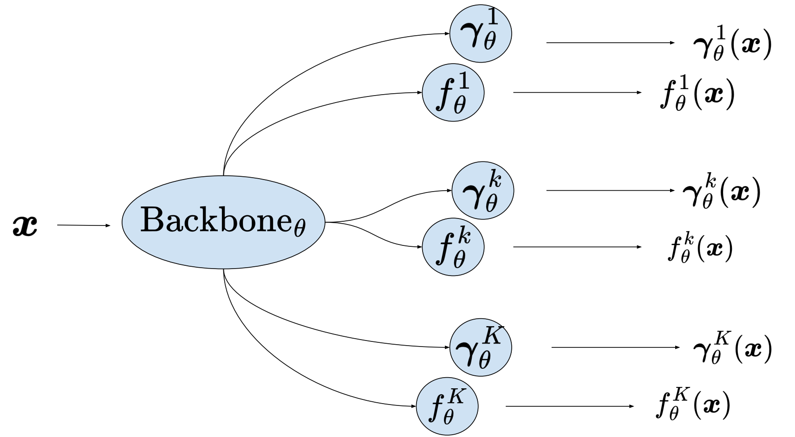

# code-rMCL

Code for associated with the NeurIPS23 publication *Resilient Multiple Choice Learning: A learned scoring scheme with application to audio scene analysis*.

<div align="center"> <h3> Abstract </h3>  </div>
<div align="justify">

We introduce Resilient Multiple Choice Learning (rMCL), an extension of the MCL approach for conditional distribution estimation in regression settings where multiple targets may be sampled for each training input. Multiple Choice Learning is a simple framework to tackle multimodal density estimation, using the Winner-Takes-All (WTA) loss for a set of hypotheses. In regression settings, the existing MCL variants focus on merging the hypotheses, thereby eventually sacrificing the diversity of the predictions. In contrast, our method relies on a novel learned scoring scheme underpinned by a mathematical framework based on Voronoi tessellations of the output space, from which we can derive a probabilistic interpretation. After empirically validating rMCL with experiments on synthetic data, we further assess its merits on the sound source localization problem, demonstrating its practical usefulness and the relevance of its interpretation.

</br>

The file structure is organized as follows:
```
.
├── README.md
└── toy-rMCL # Toy example experiments.
    └── ...
└── audio-rMCL # Audio experiments.
    └── ...
└── images # Folder with gifs and images
    └── ...
...
```

## How to create your own rMCL model ? 

For any machine learning task for which the distribution $p(\boldsymbol{y}|\boldsymbol{x})$ of the output $\boldsymbol{y} \in \mathcal{Y}$ to be predicted given the input $\boldsymbol{x} \in \mathcal{X}$ may be multimodal, the proposed rMCL model with its associated training scheme can be helpful. 

Turning your model into a Multi-hypothesis rMCL-version involves the following steps.

1. Adapting your network architecture for producing several *hypotheses* with their associated *scores* for a given input (See the Figure below)



Say you have a given model `SimpleModel` which leverages a representation from a `FeatureExtractor`, and produces an output from a `FinalModule`.

```python
class FeatureExtractor(nn.Module):
    def __init__(self):
        super(FeatureExtractor, self).__init__()
        # ... 
    def forward(self, x):
        # ...

class FinalModule(nn.Module):
    def __init__(self, in_features, out_features):
        super(FinalModule, self).__init__()
        # ...
    def forward(self, x):
        # ...

class SimpleModel(nn.Module): 
    def __init__(self, output_dim):
        super(SimpleModel, self).__init__()
        self.features = FeatureExtractor()
        in_features = self.features.shape[-1] # Assuming self.features of shape [batch,in_features]
        self.final_module = FinalModule(in_features, output_dim)

    def forward(self, x):
        x = self.FeatureExtractor(x)
        x = self.FinalModule(x)
        return x
```

The `SimpleModel` can be turned into an rMCL version, modifying the class as such  

``` python
class rMCL_SimpleModel(nn.Module):
    def __init__(self, output_dim):
        super(rMCL_SimpleModel, self).__init__()
        self.features = FeatureExtractor()
        in_features = self.features.shape[-1] # Assuming self.features of shape [batch,in_features]
        self.final_module_hypothesis = nn.ModuleDict()
        self.final_module_scores = nn.ModuleDict()

        for k in range(self.num_hypothesis) :  
            self.final_module_hypothesis['hyp_'+'{}'.format(k)] = FinalModule(in_features=in_features, out_features=output_dim)
            self.final_module_scores['hyp_'+'{}'.format(k)] = FinalModule(in_features=in_features, out_features=1)
        
    def forward(self, x):
        x = self.FeatureExtractor(x)
        x = self.FinalModule(x)
        outputs_hyps = []
        confidences = []
        
        for k in range(self.num_hypothesis) :
            outputs_hyps.append((self.final_module_hypothesis['hyp_'+'{}'.format(k)](x))) # Shape [batch,output_dim]
            confidences.append(torch.nn.Sigmoid()(self.final_module_scores['hyp_'+'{}'.format(k)](x)))# Shape [batch,1]

        hyp_stacked = torch.stack(outputs_hyps, dim=-2) # Shape [batch,num_hypothesis,output_dim]
        conf_stacked = torch.stack(confidences, dim=-2) # Shape [batch,num_hypothesis,1]
        return hyp_stacked, conf_stacked 
```

where

* `batch` (int): is the batch size. 
* `output_dim` (int): is the dimension of the output space $\mathcal{Y}$.
* `num_hypothesis` (int): is the number of hypotheses $K$ used in the model.

2. Adapting the optimization criterion for training the hypotheses and score heads of the model.

After having modified the architecture as explained above, the rMCL optimization criterion can be used. In the classical setup, this can be performed with

```python
from toy-rMCL.losses import rmcl_loss

criterion = rmcl_loss(mode = 'wta',
                 distance = 'euclidean',
                 conf_weight = 1,
                 rejection_method = 'all')

# Given the two tuple of tensors 
# - predictions (torch.Tensor): Tuple of tensors of shape [batch,num_hypothesis,output_dim],[batch,num_hypothesis,1]
# - targets (torch.Tensor,torch.Tensor): Tuple of tensors of shape [batch,Max_targets],[batch,Max_targets,output_dim]
# the loss can then be computed with 

my_rmcl_loss = criterion(predictions, targets)

# Before differentiating (assuming an optimizer is defined)

my_rmcl_loss.backward()
```
where `Max_targets` (int) is the maximum number of targets available in the dataset for each input.

The arguments of the loss are the following:

* `mode` (str): Winner-takes-all variant (`wta`, `wta-relaxed`, `wta-top-n`) to choose. Defaults to `wta`.
* `top_n` (int): Value of n when applying the top_n variant. Defaults to 1.
* `distance` (str): Underlying distance to use for the WTA computation. Defaults to 'euclidean'.
* `epsilon` (float): Value of epsilon when applying the wta-relaxed variant. Defaults to 0.05.
* `conf_weight` (int): Weight of the confidence loss ($\beta$ parameter). Defaults to 1.
*  `rejection_method` (str): Type of rejection, i.e., update of the negative hypothesis to perform. Defaults `uniform_negative`.
* `number_unconfident` (int): Number of negative hypothesis to update when the rejection method is `uniform_negative`. Defaults to 1.

## Reproducing paper experiments

### Toy example

For reproducing the toy example, the reader is refered to the folder [toy-rMCL](toy-rMCL), where an associated [README.md](toy-rMCL/README.md) can be found.  


*Early rMCL training dynamics (see Fig.1)*

### Audio experiments

For reproducing the experiments with audio data, the reader is refered to the folder [audio-rMCL](audio-rMCL), where an associated [README.md](audio-rMCL/README.md) can be found. 

### Citation 

If our work helped in your research, please consider citing us with the following bibtex code:

```
@inproceedings{
letzelter2023resilient,
title={Resilient Multiple Choice Learning: A learned scoring scheme with application to audio scene analysis},
author={Letzelter, Victor and Fontaine, Mathieu and P{\'e}rez, Patrick and Richard, Gael and Essid, Slim and Chen, Micka{\"e}l},
booktitle={Advances in Neural Information Processing Systems},
year={2023},
url={https://openreview.net/forum?id=eibTaY6qGI}
}
```