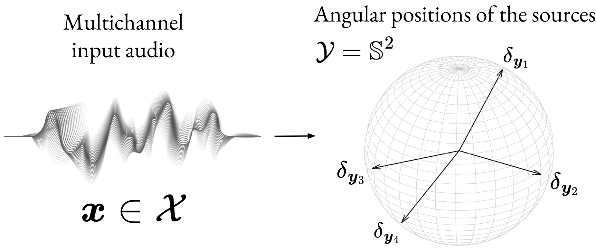

# Audio experiments (rMCL)

Code for reproducing the audio experiments of the NeurIPS23 publication *Resilient Multiple Choice Learning: A learned scoring scheme with application to audio scene analysis*.


*The sound source localization task*

The code of this repository was insipired by the following repositories

* [Multimodal Future Prediction](https://github.com/lmb-freiburg/Multimodal-Future-Prediction)
* [PILOT: Introducing Transformers for Probabilistic Sound Event Localization](https://github.com/chrschy/pilot), 
* [Attention-based Deep Recurrent Network for Localizing Acoustic Events (ADRENALINE)](https://github.com/chrschy/adrenaline) 
* [SELDNet](https://github.dev/sharathadavanne/seld-net)
* [Lightning-hydra-template](https://github.com/ashleve/lightning-hydra-template)

The file structure is organized as follows:
```
.
├── README.md
├── requirements.txt
└── logs # default path for the logs.  
└── config # Hydra config folders.
    train.yaml # Training config file. 
    eval.yaml # Evaluation config file. 
    └── model
        ├── MHConfseldnet.yaml # rMCL default config
        ├── MHseldnet.yaml # sMCL default config
        └── seldnet.yaml # PIT default config
    └── experiment 
        └── ansim
            └── default_ansim_eval.yaml
        └── resim
            └── default_resim_eval.yaml
        └── real
            └── default_real_eval.yaml
        └── dcase19
            └── default_dcase19_eval.yaml
    ... # Additionnal default config folders. 
└── src
    ├── metrics.py
    ├── eval.py
    ├── train.py
    └── models
        ├── custom-hypothesis-confidence-based.py
        ├── draft-custom-hypothesis-based.py
        ├── seldnet.py
        └── modules.py
    └── data
        ├── TUTSoundEventsDataModule.py
        └── data_handlers
            └── tut_sound_events.py
...
```

## Setup

If you are using conda, you can create and activate a new conda environment as follows:

```
conda create -y --name audioenv python=3.8.16
conda activate audioenv
```

Then, run the following command for installing the required packages listed in the requirements-audio.txt file.

```
pip install -r requirements-audio.txt
```

# Reproducing audio evaluation results

## Datasets and pre-processing

We used the ANSYN, RESYN datasets originally introduced in [SELDNet](https://github.dev/sharathadavanne/seld-net) [C]. Further investigations on the REAL [C] and DCASE19 [D] datasets were also performed.   

1. [ANSIM](https://zenodo.org/records/1237703) (TUT Sound Events 2018 - Ambisonic, Anechoic and Synthetic Impulse Response Dataset).
2. [RESIM](https://zenodo.org/records/1237707) (TUT Sound Events 2018 - Ambisonic, Reverberant and Synthetic Impulse Response Dataset).
3. [REAL](https://zenodo.org/record/1237793#.Y_IQwS_pNQI) (TUT Sound Events 2018 - Ambisonic, Reverberant and Real-life Impulse Response Dataset). 
4. [DCASE19](https://dcase.community/challenge2019/task-sound-event-localization-and-detection) (TAU Spatial Sound Events 2019 - Ambisonic and Microphone Array, Development and Evaluation Datasets). 

We pre-processed the dataset following the same procedure as in [A,B] i.e.,

1. The audio-files were converted into sequences of `sequence_duration`-seconds files.
2. Each of those sequences were splitted into chunks of length `chunks` to be used as training samples.
3. Spectrogram computation was performed offline for saving computation, using Hann window with length `frame_length` s used for Short Term Fourier Transform (STFT) estimation, with 50\% overlapping frames and `num_fft_bins` Fast Fourier Transform (FFT) bins.
The input for the model comprised both amplitude and phase information, stacked channel-wise.

We used `sequence_duration=30` (except for DCASE19 where `sequence_duration=60`), `chunks=0.5`, `frame_length=0.04` and `num_fft_bins=2048` as in [A].
The data loading and processing can be adjusted using the `src.data.TUTSoundEventsDataModule.py` script, which itself calls the `TUTSoundEvents` class in `src.data.data_handlers.tut_sound_events.py`.

## Models

### Architectures

Complete architecture of the used models based on the seldnet CRNN backbone [C] are given is the folder `src.models` folder. 
* `hypothesis-confidence-based.py` corresponds to the rMCL model.
* `hypothesis-based.py` corresponds to the vanilla WTA model.
* `seldnet.py` contains the PIT Baseline implemented in [Attention-based Deep Recurrent Network for Localizing Acoustic Events (ADRENALINE)](https://github.com/chrschy/adrenaline) (See [A,B]).
* `module.py` contains the necessary modules for building the above architectures. 

### Trained models 

Trained models (.ckpt files) on the pre-processed data given below are given in this google drive [link](https://drive.google.com/drive/folders/1EiHkKy6kbnjNI16Z24-B4FGYFF9erHk3?usp=sharing).

Folders in this drive link are organized as follows: 

```
.
└── Checkpoints # Folder for trained models checkpoints for reproducing the paper results. 
    └── Ansyn # Checkpoints on Ansyn
        ├── ...
    └── Resyn # Checkpoints on Resyn
        ├── ...
    └── Real # Checkpoints on Real
        ├── ...
    └── Dcase19 # Checkpoints on Dcase19
        ├── ...
```

## Evaluation script 

Fonctions for computing the metrics of the paper are given in the [metrics.py](audio-rMCL/src/metrics.py) script.

For evaluating the trained model on the test set using those metrics, the following arguments will need to be overriden:
* `ckpt_path` of the trained model in `config.eval.yaml`.
* The paths of the original datasets and the processed versions in `root` and `tmp_dir` arguments of the `configs.data.ansim.yaml` and `configs.data.resim.yaml` folders.
* In `config.model.yaml` the path of the original dataset in `dataset_path`, the results directory in `hparams.results_dir`.

To override those, one can use a dedicated experiment config file either in `config/experiment` folder: either `default_ansim_eval.yaml` or `default_resim_eval.yaml`.   

Depending on the model type you want to evaluate: `WTA` (without scoring),  `PIT` (baseline used) or `rMCL` (with scoring) choose the appropriate model config: `MHseldnet.yaml`, `seldnet.yaml` or `MHConfseldnet.yaml`.

Then, depending on which dataset and model the evaluation is performed, either run

`python eval.py data=ansim.yaml model=[...].yaml experiment=ansim/default_ansim_eval.yaml ckpt_path='[...]'`

or 

`python eval.py data=resim.yaml model=[...].yaml experiment=resim/default_resim_eval.yaml ckpt_path='[...]'`

where the `[...]` need to be filled. Please also override the number of hypothesis in you are using a multi-hypothesis model, e.g., adding `model.hparams.num_hypothesis=` in the above command.
The evaluation should be performed automatically on the different splits of the dataset depending on the maximum number of sources in the recordings considered (D1, D2 or D3). 

## Training models

We provide all the necessary content for retraining the proposed models on the given datasets, including:

 - The [utils.py](audio-rMCL/src/utils/utils.py) file containing all the necessary losses. 
 - The [TUTSoundEventsDataModule.py](audio-rMCL/src/data/TUTSoundEventsDataModule.py) data module associated with the [tut_sound_events.py](audio-rMCL/src/data/data_handlers/tut_sound_events.py) data loader. 
 - The optimizer configuration is given in the [modules.py](audio-rMCL/src/models/modules.py).
 - More details on the configuration used are given in the [configs](audio-rMCL/configs) folder.

For re-training from scratch models please run commands in the form: 

`python train.py data=[...].yaml  model=[...].yaml experiment==[...].yaml`

where templates of the yaml configs files of each blocks are given in the `configs` directory. 

### Citation 

If our work helped in your research, please consider citing us with the following bibtex code:

```
@inproceedings{letzelter2023resilient,
  title={Resilient Multiple Choice Learning: A learned scoring scheme with application to audio scene analysis},
  author={Letzelter, Victor and Fontaine, Mathieu and P{\'e}rez, Patrick and Richard, Gael and Essid, Slim and Chen, Micka{\"e}l},
  booktitle={Advances in Neural Information Processing Systems},
  year={2023}
}={https://openreview.net/forum?id=eibTaY6qGI}
```

## References

[A] Schymura, C., Bönninghoff, B., Ochiai, T., Delcroix, M., Kinoshita, K., Nakatani, T., Araki, S., Kolossa, D. (2021) PILOT: Introducing Transformers for Probabilistic Sound Event Localization. Proc. Interspeech 2021, 2117-2121, doi: 10.21437/Interspeech.2021-124

[B] Schymura, C., Ochiai, T., Delcroix, M., Kinoshita, K., Nakatani, T., Araki, S., & Kolossa, D. (2021, January). Exploiting attention-based sequence-to-sequence architectures for sound event localization. In 2020 28th European Signal Processing Conference (EUSIPCO) (pp. 231-235). IEEE.

[C] Adavanne, S., Politis, A., Nikunen, J., & Virtanen, T. (2018). Sound event localization and detection of overlapping sources using convolutional recurrent neural networks. IEEE Journal of Selected Topics in Signal Processing, 13(1), 34-48.

[D] Adavanne, S., Politis, A., & Virtanen, T. (2019). A multi-room reverberant dataset for sound event localization and detection. arXiv preprint arXiv:1905.08546.
