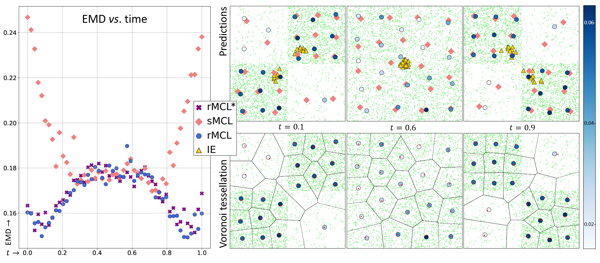

# Toy experiment (rMCL)

Code for reproducing the toy-experiments of the NeurIPS23 publication *Resilient Multiple Choice Learning: A learned scoring scheme with application to audio scene analysis*.

The repository structure is organized as follows:
```
.
├── README.md
├── datasets.py # For handling the synthetic datasets. 
├── eval.py # For performing evaluation of the models and plotting the quantitative results. 
├── losses.py # Custom losses used. 
├── models.py # Models.
├── train.py # Training script. 
├── train_multiple.py # Ensembles training script.
├── utils.py # Useful functions. 
├── requirements-toy.txt
└── checkpoints # Folder for storing the models checkpoints. 
    ├── checkpoints_mh # For the sMCL checkpoints. 
    ├── checkpoints_rmcl_star # For the rMCL* checkpoints. 
    ├── checkpoints_rmcl # For the rMCL checkpoints. 
    ├── checkpoints_ensembles  # Intermediate folder each of the IE members checkpoints.
    ├── checkpoints_ensembles_saved # Best checkpoints for each of the IE members. 
└── data_saved # Folder where the emd results are stored. 
    ├── emd_results.pickle
└── config # Config files folder. Contains default (config.yaml) and overrides config files.  
    ├── config.yaml 
    ├── override_config_rmcl_star.yaml 
    ├── override_config_rmcl.yaml
    ├── override_config_single.yaml
    └── override_config_smcl.yaml
└── figures # Figures folder.
    ...
```

## Setup

If you are using conda, you can create and activate a new conda environment as follows:

```
conda create -y --name venv python=3.8.16
conda activate venv
```

Then, run the following command for installing the required packages listed in the requirements.txt file.

```
pip install -r requirements-toy.txt
```

## Reproducing evaluation results

To reproduce Figure 1 from our paper, you can run the following command:

```
python eval.py --t_values=0.1,0.6,0.9 --show_submission_plot=True --n_samples_centroids_compt=1000 --compute_emd=False --ensemble_prediction=True --plot_ie=False
```

For a more precise reproduction of the results and computation of the EMD metric (instead of using stored values), you can run:

```
python eval.py --t_values=0.1,0.6,0.9 --ensemble_prediction=True --show_submission_plot=True --n_samples_centroids_compt=35000 --compute_emd=True --emd_compt_n_input_samples=50 --emd_compt_n_gt_samples_per_frame=1000 --plot_ie=False
```

where: 
* `t_values`: Input t values used for the visualisations. They should be provided as a list of comma-separated values.
* `show_submission_plot`: Boolean value indicating whether to plot the submission Figure.
* `n_samples_centroids_compt`: Number of samples used for centroids computation in the Voronoi cells. Specify an integer value for this parameter.
* `compute_emd`: Boolean value specifying whether to compute the Earth Mover's Distance (EMD) results. The results will be stored in a separate pickle file.
* `emd_compt_n_input_samples`: Integer specifying the equally spaced input (t) samples in the emd computation.
* `emd_compt_n_gt_samples_per_frame`: Integer expressing the number of ground truth (2D) samples per frame in the emd computation
* `ensemble_prediction`: Boolean value indicating whether to perform predictions by the IE members. 
* `plot_ie`: Boolean value indicating whether to plot the IE EMD results in the left part of the Figure. 


*Figure 1 of the NeurIPS publication*


*Continuity of the predictions for a trained rMCL as t evolves.*

## Training models

To train the models, first run the following command for preparing the folders structure:

```
mv checkpoints checkpoints-saved ; mkdir checkpoints ; cd checkpoints ; mkdir checkpoints_ensembles checkpoints_ensembles_saved checkpoints_rmcl checkpoints_rmcl_star checkpoints_smcl ; cd ..
```

Then run the following commands successively:

```
python train.py --override_config_path=config/override_config_rmcl_star.yaml 
python train.py --override_config_path=config/override_config_rmcl.yaml
python train.py --override_config_path=config/override_config_smcl.yaml
```

And then run:

```
python train_multiple.py
```

This last command allows to train the IE from 20 different random initializations. 

### Citation 

If our work helped in your research, please consider citing us with the following bibtex code:

```
@inproceedings{letzelter2023resilient,
  title={Resilient Multiple Choice Learning: A learned scoring scheme with application to audio scene analysis},
  author={Letzelter, Victor and Fontaine, Mathieu and P{\'e}rez, Patrick and Richard, Gael and Essid, Slim and Chen, Micka{\"e}l},
  booktitle={Advances in Neural Information Processing Systems},
  year={2023}
}
```

